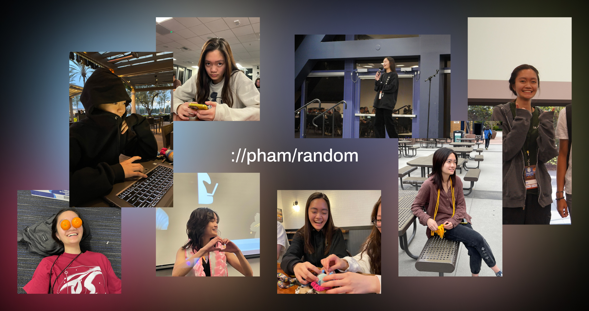

# pham-api


[](https://app.fossa.com/projects/git%2Bgithub.com%2Falexanderl19%2Fpham-api?ref=badge_shield)

<https://pham-api.alexanderliu.dev/>

> **Note**
>
> This project was created with explicit permission from pham. Direct all questions and concerns to <a@alexanderliu.com>.

## Endpoints

### /random

GET `/api/v1/random`

```sh
curl https://pham-api.alexanderliu.dev/api/v1/random
```

**Response:**

```json
{
  "src": "https://pham-api.alexanderliu.dev/photos/<uuid>"
}
```

## License

This repo has been made source available, but is **not** currently licensed under an open source license.

Copyright © 2023 Alexander Liu


[](https://app.fossa.com/projects/git%2Bgithub.com%2Falexanderl19%2Fpham-api?ref=badge_large)